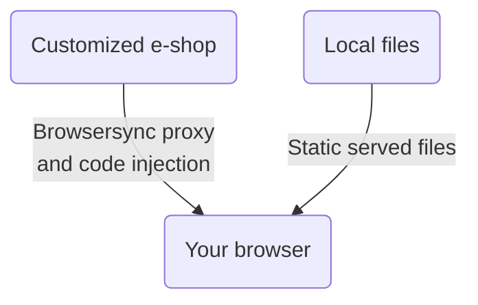

# Shoptet Bender 🤖

## Introduction
Shoptet Bender proxies remote e-shop to localhost while injecting and serving your local `style.css` and `script.js`. This tool enables to development of visual changes without breaking the production e-shop. It is also suitable for Premium e-shop development, while emulation of the Blank mode is possible.

## How it works

## Install
Node >= 14 prerequisited\
Install global using yarn:\
`yarn global add git+https://github.com/shoptet/shoptet-bender.git`

ℹ️ On Windows platform, you may need to add Yarn binary to your path:
- copy the output of the `yarn global bin` command, e.g. *C:\Users\YOUR_PROFILE\AppData\Local\Yarn\bin*
- open "**System properties**" and click on the "**Environment Variables**" button
- select "**Path**", click on "**Edit**" -> "**New**", paste the copied output and save
- you need to open a new instance of the CLI interface to take an effect

## Usage
### Step-by-step guide to start

1. Create a folder for your files (css, js) that need to be injected to remote e-shop on localhost (let's say "my-project")
2. Inside your project folder create another folder named "src"
3. Create or move your "style.css" and "script.js" files into "src" folder
4. Run --remote e-shop in console (let's say "shp-bender --remote https://classic.shoptet.cz/")

And you're ready to go -> enjoy coding and development ;)

**OR**

Try `shp-bender -h` for CLI help

## Posible tool improvements
Shoptet Bender is an open-source project, so your PRs are very welcomed. There are some suggestions for possible features, as Shoptet don't have the resources to develop this tool actively. So it is left as is for your active development. Some minor feature updates are possible.
What could be done:
- [ ] tools integration (Gulp, Grunt)
- [ ] files concatenation
- [ ] HEAD and BODY scripts location - this could better emulate admin fields