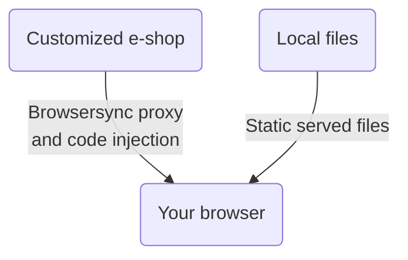

# Shoptet Bender 🤖
## Introduction
Shoptet Bender proxies remote e-shop to localhost while injecting and serving your local JavaScripts and CSS styles. This tool enables the development of visual changes without breaking the production e-shop. It is also suitable for Premium e-shop development, while emulation of the Blank mode is possible.

## How it works



## Install
Node >= 18 prerequisited\
Install global using yarn:\
`yarn global add git+https://github.com/shoptet/shoptet-bender.git`

ℹ️ On Windows platform, you may need to add Yarn binary to your path:
- copy the output of the `yarn global bin` command, e.g. *C:\Users\YOUR_PROFILE\AppData\Local\Yarn\bin*
- open "**System properties**" and click on the "**Environment Variables**" button
- select "**Path**", click on "**Edit**" -> "**New**", paste the copied output and save
- you need to open a new instance of the CLI interface to take an effect

## Usage
### Step-by-step guide to start

1. 📁 If you want to use the prepared build step, create a following folder structure:

```
src/
├── footer/
│   ├── script1.js
│   └── script2.js
├── header/
│   ├── markup.html
│   └── style.css
└── orderFinale/
    └── remarketing.js
```

2. 📝 Create or move your script and styles to the corresponding folders
3. 🖥️ Choose e-shop url, let's say Classic `shp-bender --remote https://classic.shoptet.cz/`

And you're ready to go -> enjoy coding and development 🎉

**OR**

Try `shp-bender -h` for CLI help

**OR**

🚀 Use our [Boilerplate wizard](https://github.com/shoptet/create-visual-addon-boilerplate) for even faster start. 🚀

### Removing existing scripts and styles

If you want to remove existing scripts and styles, you can use the `--removeHeaderIncludes` or `--removeFooterIncludes` flag followed by the string you want to remove. You can target for example number of the addon, or specific URL, project includes or comment in the script.

## Possible tool improvements
Shoptet Bender is an open-source project, and we’d love your help! Shoptet doesn’t have the resources to work on this tool continuously, so it’s a great chance for you to jump in and make it better. We’ve listed some feature ideas to get you started, but feel free to create your own. Even small updates can make a big difference, and your contributions are really valued!
